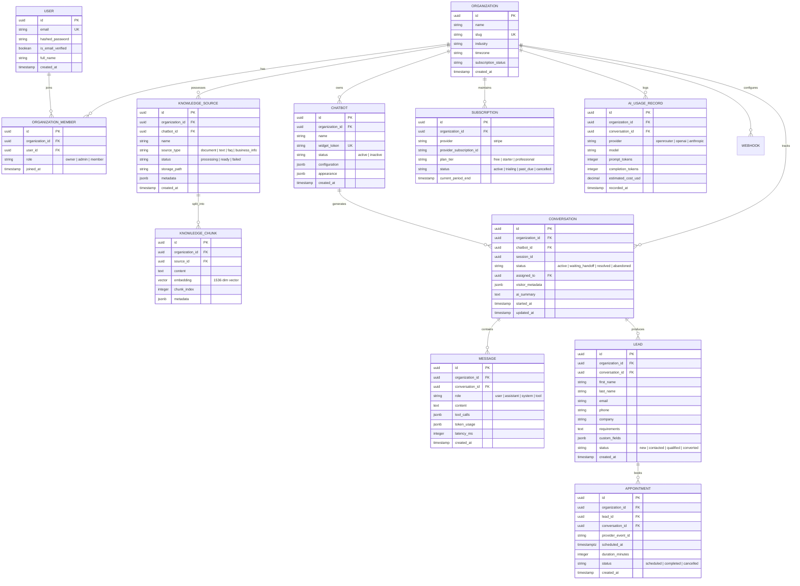

# Architecture & Technology Stack Specification

**Platform:** AI-Powered Chatbot SaaS Platform (AdsZoo Agent)  
**Reference Document:** `PDR/AI_Chatbot_SaaS_Product_Requirements_Document_v1.1_OpenRouter.md`  
**Classification:** Internal Engineering Specification  
**Version:** 1.0  
**Status:** Approved for Architectural Planning  

---

## 1. Executive Technical Summary

The AdsZoo Agent platform is a multi-tenant, cloud-native conversational AI SaaS solution designed to provide small and medium-sized businesses (SMBs) with an autonomous, business-aware website chatbot. 

Key technical characteristics:
- **Zero-Code Integration:** End-client deployment through a single asynchronous JavaScript `<script>` tag.
- **Strict Multi-Tenant Isolation:** Guaranteed separation of data, vector indices, conversation logs, and business documents across organizations.
- **Cost-Controlled RAG Pipeline:** Ingestion of proprietary documents, FAQs, and business metadata into PostgreSQL via `pgvector`, with dynamic context injection into LLM prompts.
- **Provider-Agnostic LLM Gateway:** Unified OpenRouter API gateway integration backed by direct OpenAI and Anthropic provider adapters for high availability.
- **Automated Conversational Commerce:** Native lead qualification, Google Calendar appointment scheduling, real-time human operator handoff, and Stripe subscription management.

---

## 2. Technology Stack Evaluation & Selection

### 2.1 Backend Core Stack

| Component | Selected Technology | Version | Rationale & Architectural Suitability |
| :--- | :--- | :--- | :--- |
| **Language** | **Python** | 3.11+ | Optimal ecosystem for AI/LLM integration; robust asynchronous runtime support; strong typing with PEP 604/695. |
| **Web Framework** | **FastAPI** | 0.111+ | High-throughput asynchronous ASGI framework; native Pydantic v2 data validation; auto-generated OpenAPI 3.1 documentation; native dependency injection. |
| **Database Engine** | **PostgreSQL** | 15+ | Enterprise-grade ACID relational database; advanced JSONB querying; supports native vector similarity indexing via `pgvector`. |
| **Vector Extension** | **`pgvector`** | 0.7+ | Eliminates operational overhead of maintaining a separate vector database (e.g. Pinecone, Qdrant) for v1; transactional consistency between relational data and embeddings. |
| **ORM** | **SQLAlchemy** | 2.0 (asyncio) | Strictly typed declarative mappings; asynchronous session management; robust connection pooling. |
| **Database Migrations**| **Alembic** | 1.13+ | Version-controlled, reversible schema migrations integrated with SQLAlchemy models. |
| **Cache & In-Memory Store** | **Redis** | 7.2+ | Low-latency session state storage; distributed rate limiting; Pub/Sub messaging; queue broker for asynchronous tasks. |
| **Background Processing** | **Celery / ARQ** | Celery 5.4+ / ARQ 0.25+ | Offloads heavy CPU and network tasks (PDF text extraction, chunking, embedding generation, webhook dispatch, analytics rollups). |
| **API Validation** | **Pydantic** | v2.7+ | Rust-backed blazing-fast parsing and strict validation of HTTP request bodies, query params, and environment configurations. |

### 2.2 Artificial Intelligence & RAG Stack

| Component | Selected Technology | PRD Reference | Rationale & Architectural Suitability |
| :--- | :--- | :--- | :--- |
| **Primary LLM Gateway** | **OpenRouter API** | PRD v1.1, REQ-AI-07 | Single unified API for routing across top-tier models (`openai/gpt-4o-mini`, `anthropic/claude-sonnet-5`, `meta-llama/llama-3.1-8b-instruct`); eliminates vendor lock-in; unified cost tracking. |
| **Direct Failover LLMs** | **OpenAI SDK / Anthropic SDK** | REQ-AI-07 | Native SDK implementations providing fallback routes if the primary gateway experiences degraded performance. |
| **Embedding Model** | **OpenAI `text-embedding-3-small`** | REQ-KB-05 | 1536 dimensions; high semantic fidelity; industry-leading price-performance ratio ($0.02 / 1M tokens). |
| **Vector Indexing** | **HNSW (`vector_cosine_ops`)** | PRD §7.7, §13.1 | Hierarchical Navigable Small World index in pgvector; provides sub-50ms approximate nearest-neighbor retrieval at scale with high recall. |
| **Document Parsing** | **`pypdf`, `python-docx`, `markdown`** | REQ-KB-02 | Robust file ingestion handling binary PDFs, Microsoft Word docs, and plain text/markdown without heavyweight external dependencies. |

### 2.3 Frontend Dashboard Stack

| Component | Selected Technology | Version | Rationale & Architectural Suitability |
| :--- | :--- | :--- | :--- |
| **Application Framework** | **Next.js (App Router)** | 14+ | React Server Components for ultra-fast initial page loads; streaming SSR; route-based code splitting; production SaaS standard. |
| **Programming Language** | **TypeScript** | 5.4+ (Strict) | Compile-time type safety; shared schema interfaces between client and server APIs. |
| **Styling Engine** | **Tailwind CSS** | 3.4+ | Utility-first CSS ensuring minimal production bundle size; rapid prototyping and consistent spacing/typography design tokens. |
| **UI Component Primitives**| **shadcn/ui (Radix UI)** | Latest | Unstyled, accessible (WCAG 2.1 AA compliant) component library; full ownership of component source code; customizable design system. |
| **Server State Management** | **TanStack Query (React Query)** | v5 | Client caching, automatic background refetching, mutation state tracking, and query invalidation. |
| **Client UI State** | **Zustand** | 4.5+ | Minimalist, boilerplate-free state store for modal states, navigation drawers, and widget live preview overrides. |
| **Data Visualizations** | **Recharts** | 2.12+ | Composable SVG charting library for conversation trends, lead funnel stages, and AI cost metrics. |
| **Form Management** | **React Hook Form + Zod** | Latest | Performant uncontrolled forms with type-safe schema validation matching backend Pydantic models. |

### 2.4 Embeddable Client Widget Stack

| Component | Selected Technology | Rationale & Architectural Suitability |
| :--- | :--- | :--- |
| **Architecture** | **Vanilla TypeScript + Vite** | Zero external frameworks (no React/Vue runtime overhead); compiles to a single standalone IIFE `<script>` file. |
| **Bundle Size Budget** | **<40 KB (gzipped)** | Ensures non-blocking, sub-second widget load times on SMB client websites. |
| **DOM Encapsulation** | **Shadow DOM (`attachShadow({ mode: 'open' })`)** | Complete isolation from host website CSS; guarantees immunity against WordPress, Shopify, or Squarespace theme style bleeding. |
| **Streaming Protocol** | **Server-Sent Events (SSE)** | Unidirectional, lightweight text stream over HTTP/2; automatic browser reconnection handling; proxies seamlessly through corporate firewalls. |

---

## 3. High-Level Architecture Diagram

```
┌─────────────────────────────────────────────────────────────────────────────────┐
│                                CLIENT PLATFORMS                                 │
│                                                                                 │
│   ┌─────────────────────────────────────┐   ┌───────────────────────────────┐   │
│   │ Next.js 14 Web Dashboard (Admin/Org)│   │  Embeddable Widget (Client)   │   │
│   │ TypeScript · Tailwind · shadcn/ui   │   │  Vanilla TS · Shadow DOM · SSE│   │
│   └──────────────────┬──────────────────┘   └───────────────┬───────────────┘   │
└──────────────────────┼──────────────────────────────────────┼───────────────────┘
                       │                                      │
                       ▼                                      ▼
┌─────────────────────────────────────────────────────────────────────────────────┐
│                      REVERSE PROXY & INGRESS (NGINX / CDN)                      │
│        TLS Termination · Global Rate Limiting · Static Asset Caching · CORS     │
└──────────────────────────────────────┬──────────────────────────────────────────┘
                                       │
                                       ▼
┌─────────────────────────────────────────────────────────────────────────────────┐
│                        FASTAPI APPLICATION ENGINE                               │
│                                                                                 │
│   ┌─────────────────────────────────────────────────────────────────────────┐   │
│   │ AUTH & TENANT MIDDLEWARE                                                │   │
│   │ JWT Bearer Auth · Argon2id · RBAC Guards · Tenant Context Injection     │   │
│   └────────────────────────────────────┬────────────────────────────────────┘   │
│                                        │                                        │
│   ┌────────────────────────────────────▼────────────────────────────────────┐   │
│   │ CONTROLLERS / API ROUTES                                                │   │
│   │ /api/v1/auth          /api/v1/chatbots      /api/v1/conversations       │   │
│   │ /api/v1/knowledge     /api/v1/leads         /api/v1/appointments        │   │
│   │ /api/v1/analytics     /api/v1/billing       /api/widget/* (Public)      │   │
│   └────────────────────────────────────┬────────────────────────────────────┘   │
│                                        │                                        │
│   ┌────────────────────────────────────▼────────────────────────────────────┐   │
│   │ TENANT-ISOLATED DOMAIN SERVICES                                         │   │
│   │ ChatbotService    · KnowledgeService · ConversationService              │   │
│   │ LeadService       · AppointmentService· BillingService                  │   │
│   │ AnalyticsService  · RAGEngine        · NotificationService              │   │
│   └────────────────────────────────────┬────────────────────────────────────┘   │
│                                        │                                        │
│   ┌────────────────────────────────────▼────────────────────────────────────┐   │
│   │ INFRASTRUCTURE & EXTERNAL ADAPTERS                                      │   │
│   │ LLMAdapter (OpenRouter/OpenAI/Anthropic) · VectorStore (pgvector)       │   │
│   │ CalendarAdapter (Google OAuth/API)      · BillingAdapter (Stripe)       │   │
│   │ StorageAdapter (S3/MinIO)               · EmailAdapter (SMTP/SendGrid)  │   │
│   └──────┬──────────────────┬─────────────────┬───────────────────┬─────────┘   │
└──────────┼──────────────────┼─────────────────┼───────────────────┼─────────────┘
           │                  │                 │                   │
           ▼                  ▼                 ▼                   ▼
┌──────────────────┐  ┌───────────────┐  ┌───────────────┐  ┌─────────────────────┐
│  POSTGRESQL 15+  │  │    REDIS 7    │  │CELERY WORKERS │  │    EXTERNAL APIS    │
│  Relational Data │  │ Rate Limiting │  │ Async Parsing │  │ OpenRouter / OpenAI │
│  pgvector (HNSW) │  │ Task Queue    │  │ Chunk / Embed │  │ Stripe Payments     │
│  Row-Level Sec.  │  │ Session Cache │  │ Scheduled Cron│  │ Google Calendar     │
└──────────────────┘  └───────────────┘  └───────────────┘  └─────────────────────┘
```

---

## 4. Multi-Tenant Data Model & Entity Relations

All domain entities (except global users and system plans) contain an explicit, indexed `organization_id: UUID` foreign key.



---

## 5. Security Architecture & Threat Mitigation

### 5.1 Multi-Tenant Isolation Defense-in-Depth
1. **Service Layer Isolation:** All repository and service method signatures mandate `organization_id: UUID`. Queries without this parameter are disallowed by code review and static analysis.
2. **Database Row-Level Security (RLS):** 
   - PostgreSQL RLS enabled across all tenant tables.
   - At the beginning of each database session/transaction:
     ```sql
     SET LOCAL app.current_tenant_id = 'c4b8b6c0-6f91-4e2b-9877-1234567890ab';
     ```
   - RLS Policy:
     ```sql
     CREATE POLICY tenant_isolation_policy ON conversations
     FOR ALL
     USING (organization_id = NULLIF(current_setting('app.current_tenant_id', true), '')::uuid);
     ```
3. **Automated Cross-Tenant CI Suite:** Integration tests execute malicious cross-tenant payload requests (e.g., Tenant A requesting `/api/v1/leads/{tenant_b_lead_id}`) asserting that the API consistently returns HTTP 404/403.

### 5.2 Widget Two-Token Protocol
- **Public Widget Token (`widget_token`):**
  - Generated upon chatbot creation.
  - Safe to embed in public HTML.
  - Grants read-only access to `/api/widget/config` (theme, bot name, logo, launcher position).
  - Grants permission to invoke `POST /api/widget/session` to initiate a conversation.
- **Ephemeral Session Token (`session_token`):**
  - Generated server-side upon session creation.
  - Signed JWT containing `session_id`, `conversation_id`, and `organization_id`.
  - Expiry: 60 minutes with rolling refresh.
  - Transmitted in request headers (`Authorization: Bearer <session_token>`).
  - Scoped strictly to creating messages and recording lead details for *that specific session*.

### 5.3 Authentication & Password Security
- Passwords hashed using **Argon2id** (memory cost: 64MB, time cost: 3 iterations, parallelism: 4).
- Access tokens: Short-lived asymmetric JWT (15–30 minutes).
- Refresh tokens: Long-lived (30 days), stored in `HttpOnly`, `SameSite=Strict`, `Secure` cookies with automatic rotation on reuse.
- Brute-force protection: Rate limiting via Redis (max 5 failed login attempts per account/IP per 10 minutes).
