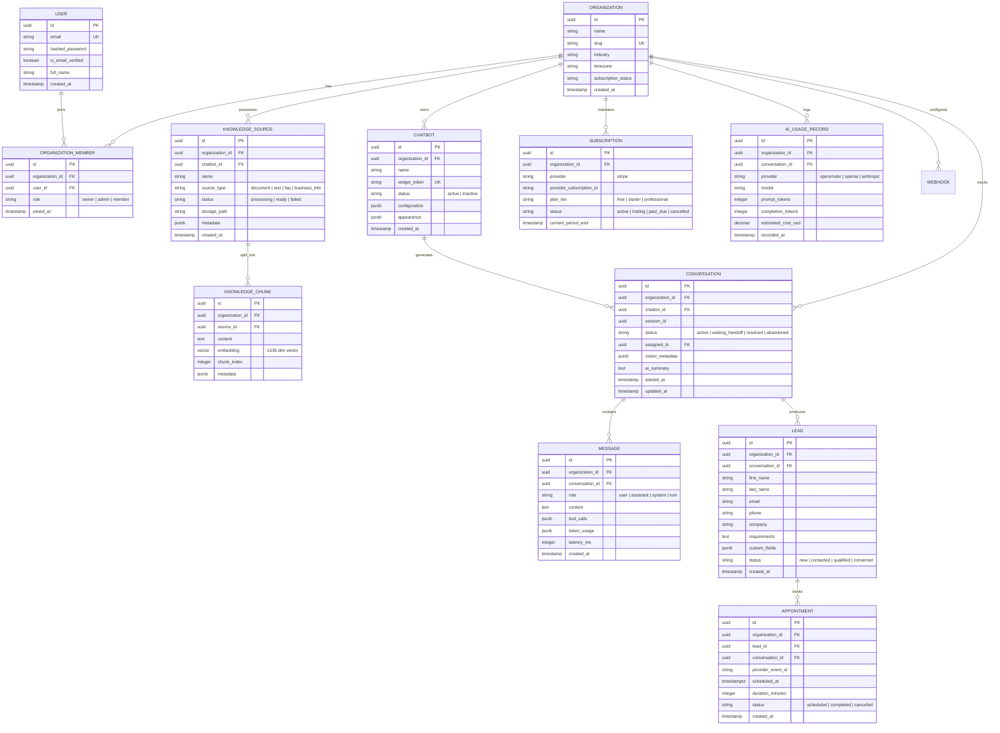

# System Architecture Specification & Engineering Design

**Platform:** `chatbot-agent` (Multi-Tenant Conversational AI SaaS)  
**Classification:** Core System Architecture Specification  
**Version:** 1.0.0  

---

## 1. High-Level Architecture Topology

```
┌─────────────────────────────────────────────────────────────────────────────────┐
│                                CLIENT PLATFORMS                                 │
│                                                                                 │
│   ┌─────────────────────────────────────┐   ┌───────────────────────────────┐   │
│   │ Next.js 14 Web Dashboard (Admin/Org)│   │  Embeddable Widget (Client)   │   │
│   │ TypeScript · Tailwind · shadcn/ui   │   │  Vanilla TS · Shadow DOM · SSE│   │
│   └──────────────────┬──────────────────┘   └───────────────┬───────────────┘   │
└──────────────────────┼──────────────────────────────────────┼───────────────────┘
                       │                                      │
               HTTPS / WebSockets                         HTTPS / SSE
                       │                                      │
                       ▼                                      ▼
┌─────────────────────────────────────────────────────────────────────────────────┐
│                      REVERSE PROXY & INGRESS (NGINX / CDN)                      │
│        TLS Termination · Global Rate Limiting · Static Asset Caching · CORS     │
└──────────────────────────────────────┬──────────────────────────────────────────┘
                                       │
                                       ▼
┌─────────────────────────────────────────────────────────────────────────────────┐
│                        FASTAPI APPLICATION ENGINE                               │
│                                                                                 │
│   ┌─────────────────────────────────────────────────────────────────────────┐   │
│   │ AUTH & TENANT MIDDLEWARE                                                │   │
│   │ JWT Bearer Auth · Argon2id · RBAC Guards · Tenant Context Injection     │   │
│   └────────────────────────────────────┬────────────────────────────────────┘   │
│                                        │                                        │
│   ┌────────────────────────────────────▼────────────────────────────────────┐   │
│   │ CONTROLLERS / API ROUTES                                                │   │
│   │ /api/v1/auth          /api/v1/chatbots      /api/v1/conversations       │   │
│   │ /api/v1/knowledge     /api/v1/leads         /api/v1/appointments        │   │
│   │ /api/v1/analytics     /api/v1/billing       /api/widget/* (Public)      │   │
│   └────────────────────────────────────┬────────────────────────────────────┘   │
│                                        │                                        │
│   ┌────────────────────────────────────▼────────────────────────────────────┐   │
│   │ TENANT-ISOLATED DOMAIN SERVICES                                         │   │
│   │ ChatbotService    · KnowledgeService · ConversationService              │   │
│   │ LeadService       · AppointmentService· BillingService                  │   │
│   │ AnalyticsService  · RAGEngine        · NotificationService              │   │
│   └────────────────────────────────────┬────────────────────────────────────┘   │
│                                        │                                        │
│   ┌────────────────────────────────────▼────────────────────────────────────┐   │
│   │ INFRASTRUCTURE & EXTERNAL ADAPTERS                                      │   │
│   │ LLMAdapter (OpenRouter/OpenAI/Anthropic) · VectorStore (pgvector)       │   │
│   │ CalendarAdapter (Google OAuth/API)      · BillingAdapter (Stripe)       │   │
│   │ StorageAdapter (S3/MinIO)               · EmailAdapter (Resend/SMTP)    │   │
│   └──────┬──────────────────┬─────────────────┬───────────────────┬─────────┘   │
└──────────┼──────────────────┼─────────────────┼───────────────────┼─────────────┘
           │                  │                 │                   │
           ▼                  ▼                 ▼                   ▼
┌──────────────────┐  ┌───────────────┐  ┌───────────────┐  ┌─────────────────────┐
│  POSTGRESQL 15+  │  │    REDIS 7    │  │CELERY WORKERS │  │    EXTERNAL APIS    │
│  Relational Data │  │ Rate Limiting │  │ Async Parsing │  │ OpenRouter / OpenAI │
│  pgvector (HNSW) │  │ Task Queue    │  │ Chunk / Embed │  │ Stripe Payments     │
│  Row-Level Sec.  │  │ Session Cache │  │ Scheduled Cron│  │ Google Calendar     │
└──────────────────┘  └───────────────┘  └───────────────┘  └─────────────────────┘
```

---

## 2. Multi-Tenant Relational Entity Model (ERD)

Every tenant entity contains a non-nullable, indexed foreign key `organization_id: UUID`.



---

## 3. Row-Level Security (RLS) & Isolation Defense-in-Depth

### 3.1 Layer 1: Application Repository Enforcing
Every data access repository method requires `org_id: UUID` as an explicit parameter. No query without an explicit tenant scope can pass code review or automated static analysis.

### 3.2 Layer 2: PostgreSQL Engine Row-Level Security
At the start of every authenticated request transaction, the database connection executes:
```sql
SET LOCAL app.current_org_id = 'c4b8b6c0-6f91-4e2b-9877-1234567890ab';
```
PostgreSQL RLS policies unconditionally restrict read, insert, update, and delete access:
```sql
CREATE POLICY tenant_isolation_conversations ON conversations
  FOR ALL
  USING (organization_id = NULLIF(current_setting('app.current_org_id', true), '')::uuid);
```

---

## 4. Two-Token Protocol & Widget Security

1. **Public Widget Token (`widget_token`):**
   - Safe to embed in public HTML: `<script src="https://cdn.example.com/widget.js" data-token="wgt_live_abc123"></script>`.
   - Grants read-only access to `/api/widget/config` (bot name, brand color, launcher icon, welcome message).
   - Allows calling `POST /api/widget/session` to initiate an anonymous visitor session.
2. **Ephemeral Session Token (`session_token`):**
   - Signed JWT containing `session_id`, `conversation_id`, and `organization_id`.
   - Emitted by `POST /api/widget/session` and retained in widget memory / `sessionStorage`.
   - Expiry: 60 minutes with rolling refresh.
   - Required for `POST /api/widget/message` and `POST /api/widget/lead`. Scoped exclusively to that session.

---

## 5. Embeddable Widget Architecture (Shadow DOM)

- **Standalone Bundle:** Compiled using Vite into a single minified IIFE bundle (`widget.js`), targeting under 40 KB gzipped.
- **Shadow DOM Mount:** Mounts into `document.createElement('div').attachShadow({ mode: 'open' })`.
- **CSS Isolation:** Internal styles are injected directly into the shadow root. External host styles (e.g., reset stylesheets or theme overrides) cannot alter button sizes, font sizes, or layout alignments.
- **Streaming Transport:** Employs Server-Sent Events (`EventSource` / `fetch` streaming) over HTTP/2 for token-by-token text streaming.
